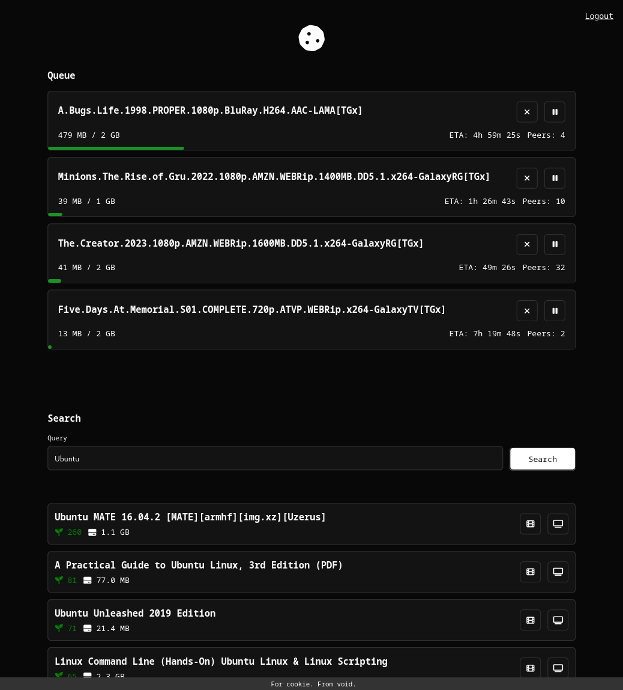

# cookie

Cookie is fastapi server that is used for connecting to a transmission rpc client, and 1337x. 



## Setup

```bash
touch .env

mkdir -p transmission/config
mkdir transmission/downloads
```


## Install

```bash
python3 -m venv venv
source venv/bin/activate
pip install -r install/requirements.txt
```

## Run

```bash
uvicorn src.main:app --reload
```